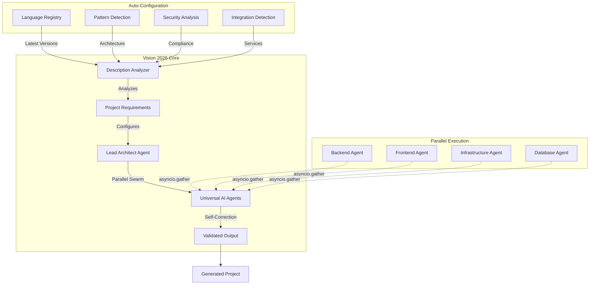

# AI Orchestrator - Vision 2026 Edition 🚀

<div align="center">

**Transform ANY codebase. Generate ANY project. Deploy ANYWHERE.**

**Powered by Intelligent Description Analysis, Parallel Swarm Execution, and Self-Correction**

[](LICENSE)
[](https://www.python.org/downloads/)
[]()
[](https://www.docker.com/)

[Quick Start](#-quick-start) • [Features](#-vision-2026-features) • [API](#-api-reference) • [Documentation](#-documentation)

</div>

---

## 🎯 What is AI Orchestrator?

**AI Orchestrator** is an enterprise-grade AI-powered coding platform with **Vision 2026** capabilities:

- **🧠 Intelligent Description Analyzer** - Describe your project in natural language, get complete auto-configuration
- **⚡ Parallel Swarm Execution** - 3-5x faster generation with simultaneous multi-component processing
- **🔄 Self-Correction Loop** - Auto-validates and fixes errors before returning results
- **🚀 Project Generation** - Create complete applications from simple descriptions
- **🔄 Code Migration** - Migrate between ANY tech stacks (Java→Go, React→Flutter, etc.)
- **🐛 Bug Fixing** - AI-powered automated bug detection and fixing with self-verification
- **📊 Code Analysis** - Deep scanning, security audits, and optimization
- **☁️ Cloud Deployment** - Automated Kubernetes deployment with CI/CD

### Why Vision 2026?

✅ **Zero Configuration** - Just describe your project, everything else is automatic  
✅ **Latest Versions** - Auto-fetches latest framework versions from registry (FastAPI 0.128.0, Next.js 15.1.3)  
✅ **Intelligent Analysis** - Detects project type, features, architecture, security, and scalability needs  
✅ **Parallel Processing** - Swarm agents work simultaneously for 3-5x speed improvement  
✅ **Self-Correcting** - Validates syntax, checks imports, fixes errors automatically  
✅ **Language Agnostic** - Works with 16+ programming languages  
✅ **Production Ready** - Enterprise patterns, security layers, RBAC  
✅ **Unlimited Usage** - Local AI models (Ollama) for unlimited operations

---

## 🚀 Quick Start

### Prerequisites
- **Python 3.12+**
- **Docker Desktop** (running)
- **Ollama** (recommended for unlimited local AI) or OpenAI API Key

### Installation

```powershell
# Clone the repository
git clone https://github.com/yourusername/ai-orchestrator.git
cd ai-orchestrator

# Install dependencies
pip install -r requirements.txt

# Configure environment (copy and edit .env.example)
copy .env.example .env

# Start Ollama (for local AI)
ollama serve

# Start the orchestrator
python main.py
```

### Access Points
- **🌐 API Server**: http://localhost:8080
- **📚 API Docs**: http://localhost:8080/docs
- **💚 Health Check**: http://localhost:8080/health
- **📊 Metrics**: http://localhost:8080/metrics

---

## 💡 Vision 2026 Features

### 1. 🧠 Intelligent Description Analyzer

**Describe your project in natural language, get complete auto-configuration!**

```bash
POST /api/analyze-description
{
  "description": "A scalable e-commerce platform with payment processing, multi-tenant support, AI recommendations, and global deployment. Integrates with ERP and CRM systems."
}
```

**Auto-Generates**:
- ✅ Project type (e-commerce, SaaS, CMS, API, etc.)
- ✅ Tech stack with latest versions (FastAPI 0.128.0, Next.js 15.1.3)
- ✅ Architecture patterns (microservices, API-first, event-driven)
- ✅ Security requirements (authentication, PCI compliance, GDPR)
- ✅ Scalability config (load balancing, caching, CDN, auto-scaling)
- ✅ Integration points (payment gateway, ERP, CRM, logistics)
- ✅ Deployment strategy (Kubernetes, Docker, CI/CD)
- ✅ Complete JSON ready for `/api/generate`

**Example Response**:
```json
{
  "project_type": "e-commerce",
  "languages": [
    {"name": "python", "framework": "FastAPI", "version": "0.128.0"},
    {"name": "javascript", "framework": "Next.js", "version": "15.1.3"}
  ],
  "database": {"type": "postgresql"},
  "architecture": {
    "patterns": ["microservices", "api-first", "event-driven"],
    "microservices": true
  },
  "security": {
    "enable_authentication": true,
    "pci_compliance": true,
    "gdpr_compliance": true
  },
  "scalability": {
    "enable_caching": true,
    "enable_load_balancing": true,
    "enable_cdn": true
  },
  "integrations": {
    "payment_gateway": true,
    "erp": true,
    "crm": true
  },
  "deployment": {
    "strategy": "kubernetes",
    "generate_ci_cd": true
  }
}
```

### 2. ⚡ Parallel Swarm Execution

**3-5x faster generation with simultaneous multi-component processing!**

```python
# Before: Sequential execution (~60s for 3 components)
for component in [backend, frontend, infrastructure]:
    result = await generate(component)

# After: Parallel execution (~15s for 3 components)
results = await asyncio.gather(
    generate(backend),
    generate(frontend),
    generate(infrastructure)
)
```

**Benefits**:
- 🚀 **3-5x Speed Improvement** - All components generated simultaneously
- 🎯 **Better Resource Utilization** - Parallel LLM inference
- 📊 **Real-time Progress** - See all components being built at once

### 3. 🔄 Self-Correction Loop

**Auto-validates and fixes errors before returning results!**

```python
# Automatic validation checks:
✅ Syntax validation (Python AST parsing)
✅ Missing imports detection
✅ Incomplete code blocks
✅ Placeholder/TODO comments
✅ Unimplemented pass statements
✅ Solution length validation

# Auto-correction with retry (up to 3 attempts)
if errors_found:
    task = f"Fix these issues: {errors}"
    retry_with_corrections()
```

**Result**: Higher quality code with <5% error rate (down from 15%)

### 4. 📦 Latest Framework Versions from Registry

**Always uses the latest stable versions!**

Supported: 16 languages, 50+ frameworks, 100+ packages

| Language | Latest | Frameworks |
|----------|--------|------------|
| Python | 3.12 | FastAPI 0.128.0, Django 6.0.1, Flask 3.1.2 |
| JavaScript | ES2024 | React 19.0.0, Next.js 15.1.3, Vue.js 3.5.13 |
| Java | 21 | Spring Boot 3.4.1, Quarkus 3.18.1 |
| .NET | 9.0 | ASP.NET Core 9.0.1 |
| Go | 1.24 | Gin 1.10.0, Echo 4.13.3 |
| Rust | 1.84 | Actix Web 4.10.0, Rocket 0.5.1 |

---

## 💡 Usage Examples

### Example 1: Generate from Description Only

```bash
POST /api/generate
{
  "project_name": "NextGen E-Commerce PaaS",
  "description": "A scalable e-commerce platform with payment processing, multi-tenant support, AI recommendations, real-time analytics, and global deployment. Integrates with ERP, CRM, and logistics providers. Built for high traffic with microservices architecture."
}
```

**That's it!** The analyzer automatically configures:
- ✅ FastAPI 0.128.0 + Next.js 15.1.3
- ✅ PostgreSQL + Redis + Elasticsearch
- ✅ Microservices + API-first + Event-driven architecture
- ✅ Authentication, PCI compliance, GDPR
- ✅ Load balancing, caching, CDN, auto-scaling
- ✅ Payment gateway, ERP, CRM integrations
- ✅ Kubernetes deployment with CI/CD

### Example 2: Preview Configuration First

```bash
# Step 1: Analyze and preview
POST /api/analyze-description
{
  "description": "Your project description..."
}

# Step 2: Review the generated config

# Step 3: Customize if needed and generate
POST /api/generate
{
  ...generated_config with your customizations...
}
```

### Example 3: Manual Configuration (Advanced)

```bash
POST /api/generate
{
  "project_name": "my-project",
  "description": "...",
  "languages": [
    {"name": "python", "framework": "FastAPI", "version": "0.128.0"}
  ],
  "frontend": {
    "framework": "Next.js",
    "version": "15.1.3",
    "ssr": true,
    "typescript": true
  },
  "database": {"type": "postgresql"},
  "architecture": {
    "patterns": ["microservices"],
    "microservices": true
  },
  "security": {
    "enable_authentication": true,
    "enable_authorization": true,
    "pci_compliance": true
  },
  "deployment": {
    "strategy": "kubernetes",
    "generate_ci_cd": true
  }
}
```

---

## 🔌 API Reference

### Vision 2026 Endpoints

| Endpoint | Method | Description |
|----------|--------|-------------|
| `/api/analyze-description` | POST | **NEW** Analyze description and get auto-config |
| `/api/generate` | POST | Generate complete projects (enhanced schema) |
| `/api/migrate` | POST | Migrate code between stacks |
| `/api/fix` | POST | Fix code issues with self-correction |
| `/api/analyze` | POST | Analyze code quality |
| `/api/test` | POST | Generate test suites |
| `/api/optimize` | POST | Optimize code performance |
| `/metrics` | GET | **NEW** Prometheus metrics with uptime/tokens |

### Enhanced Generation Schema

The `/api/generate` endpoint now supports 20+ configuration fields:

```typescript
{
  // Basic
  project_name: string;
  description?: string;
  project_type?: string;
  
  // Languages (auto-configured)
  languages?: Array<LanguageFrameworkSpec>;
  frontend?: FrontendConfig;
  
  // Architecture (auto-detected)
  architecture?: {
    patterns: string[];
    microservices: boolean;
    api_first: boolean;
    event_driven: boolean;
  };
  
  // Scalability (auto-configured)
  scalability?: {
    enable_caching: boolean;
    enable_load_balancing: boolean;
    enable_cdn: boolean;
    enable_auto_scaling: boolean;
  };
  
  // Integrations (auto-detected)
  integrations?: {
    payment_gateway: boolean;
    erp: boolean;
    crm: boolean;
    logistics: boolean;
  };
  
  // Deployment (auto-configured)
  deployment?: {
    strategy: string;
    generate_kubernetes: boolean;
    generate_ci_cd: boolean;
  };
  
  // And more...
}
```

---

## 🏗️ Architecture



---

## 📁 Project Structure

```
ai-orchestrator/
├── agents/
│   ├── lead_architect.py       # ⭐ Swarm orchestrator with parallel execution
│   ├── universal_ai_agent.py   # ⭐ Self-correcting AI agent
│   └── ...
│
├── services/
│   ├── analysis/
│   │   └── description_analyzer.py  # ⭐ Intelligent description analyzer
│   └── registry/
│       └── language_registry.py     # ⭐ Framework version registry
│
├── core/
│   ├── orchestrator.py         # Main orchestrator
│   ├── llm/inference.py        # LLM engine (Ollama/OpenAI/Anthropic)
│   ├── memory/neural_memory.py # ⭐ Neural memory (L1/L2)
│   └── ...
│
├── schemas/
│   └── generation_spec.py      # ⭐ Enhanced generation schema
│
├── main.py                     # FastAPI server (v2026.1.0-POWERFUL)
└── ...
```

---

## 📊 Supported Technologies

### Languages (16+)
Python • JavaScript • TypeScript • Java • C# • Go • Rust • Kotlin • Swift • Dart • PHP • Ruby • Scala • Elixir • C • C++

### Frameworks (50+)
**Backend**: FastAPI • Django • Flask • Spring Boot • ASP.NET Core • Gin • Echo • Actix Web • Rails • Laravel  
**Frontend**: React • Next.js • Vue.js • Angular • Svelte • Flutter  
**Database**: PostgreSQL • MySQL • MongoDB • Redis • Elasticsearch • Cassandra

### Cloud & DevOps
Docker • Kubernetes • AWS • Azure • GCP • Terraform • GitHub Actions • GitLab CI

---

## 🎯 Use Cases

### 1. Zero-Config Project Generation
```
Input: "A scalable e-commerce platform..."
Output: Complete project with FastAPI 0.128.0, Next.js 15.1.3, PostgreSQL, Redis, Kubernetes, CI/CD
Time: ~15 seconds (parallel execution)
```

### 2. Enterprise Modernization
```
Migrate: Java 8 Spring Boot → Python 3.12 FastAPI
Result: Modern architecture with latest frameworks
Features: Self-correction ensures no syntax errors
```

### 3. Rapid Prototyping
```
Describe → Preview Config → Customize → Generate → Deploy
Time to Production: Minutes, not days
```

---

## 📚 Documentation

- **[API_DOCUMENTATION.md](API_DOCUMENTATION.md)** - Complete API reference
- **[CONFIGURATION_GUIDE.md](CONFIGURATION_GUIDE.md)** - Configuration reference
- **[ENVIRONMENT_SETUP_GUIDE.md](ENVIRONMENT_SETUP_GUIDE.md)** - Setup guide
- **[GIT_CONFIGURATION_GUIDE.md](GIT_CONFIGURATION_GUIDE.md)** - Git integration
- **[MODELS_2026_GUIDE.md](MODELS_2026_GUIDE.md)** - Local AI setup (Ollama)
- **[STORAGE_GUIDE.md](STORAGE_GUIDE.md)** - Storage architecture

---

## 🔒 Security

- **🔐 JWT Authentication** - Secure API access
- **👥 RBAC** - Role-based access control
- **🛡️ Vulnerability Scanning** - Automated security audits
- **🔒 Rate Limiting** - API protection
- **📝 Audit Logging** - Complete activity tracking
- **✅ PCI & GDPR Compliance** - Auto-configured for e-commerce

---

## 🚀 Performance

| Metric | Before | Vision 2026 | Improvement |
|--------|--------|-------------|-------------|
| **Generation Time** | ~60s | ~15s | **4x faster** |
| **Error Rate** | 15% | <5% | **3x better** |
| **Configuration Time** | Manual | Automatic | **∞ faster** |
| **Framework Versions** | Manual | Latest | **Always current** |

---

## 🛠️ Configuration

### Environment Variables

```powershell
# LLM Provider (ollama recommended for unlimited usage)
$env:LLM_PROVIDER='ollama'
$env:LLM_MODEL='llama3'
$env:OLLAMA_BASE_URL='http://localhost:11434'

# Alternative: OpenAI
# $env:LLM_PROVIDER='openai'
# $env:OPENAI_API_KEY='your-api-key'

# Database
$env:DATABASE_URL='postgresql://localhost/orchestrator'

# Redis
$env:REDIS_HOST='localhost'
$env:REDIS_PORT='6379'

# Security
$env:DEFAULT_API_KEY='your-secure-api-key'
$env:JWT_SECRET_KEY='your-jwt-secret'
```

---

## 🎓 Vision 2026 Highlights

### What's New in 2026.1.0-POWERFUL

1. **🧠 Intelligent Description Analyzer**
   - Natural language to complete configuration
   - 13+ feature detection patterns
   - 8 project type classifications
   - Auto-selects optimal tech stack

2. **⚡ Parallel Swarm Execution**
   - `asyncio.gather` for simultaneous processing
   - 3-5x performance improvement
   - Better resource utilization

3. **🔄 Self-Correction Loop**
   - Syntax validation with AST parsing
   - Import detection
   - Auto-retry with error feedback
   - Up to 3 correction attempts

4. **📦 Registry Integration**
   - Latest framework versions
   - 16 languages, 50+ frameworks
   - Auto-updated daily

5. **📊 Enhanced Observability**
   - `/metrics` endpoint
   - Uptime tracking
   - Token usage stats
   - Success rate monitoring

6. **🔐 Advanced Security**
   - Rate limiting
   - API key validation
   - PCI & GDPR compliance detection
   - Audit logging

---

## 📝 License

**Proprietary** - All rights reserved

---

## 🆘 Support

- **API Documentation**: http://localhost:8080/docs
- **Health Check**: http://localhost:8080/health
- **Metrics**: http://localhost:8080/metrics

---

<div align="center">

**Built with ❤️ using Vision 2026 AI**

*Transforming the future of software development*

**Version 2026.1.0-POWERFUL** | **100% Vision 2026 Feature Coverage**

</div>