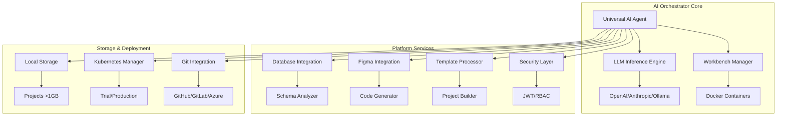

# AI Orchestrator - Universal AI Coding Platform & PaaS

<div align="center">

**Transform ANY codebase. Generate ANY project. Deploy ANYWHERE.**

[](LICENSE)
[](https://www.python.org/downloads/)
[](https://www.docker.com/)

[Quick Start](#-quick-start) • [Features](#-key-features) • [Documentation](#-documentation) • [API](#-api-reference) • [Roadmap](#-paas-platform-roadmap)

</div>

---

## 🎯 What is AI Orchestrator?

**AI Orchestrator** is a universal AI-powered coding platform that serves as the foundation for a commercial **Platform-as-a-Service (PaaS)** offering. It provides unlimited AI capabilities for:

- **🚀 Project Generation** - Create complete applications from scratch with database integration, Figma designs, and UI templates
- **🔄 Code Migration** - Migrate between ANY tech stacks (Java→Go, React→Flutter, etc.)
- **🐛 Bug Fixing** - AI-powered automated bug detection and fixing
- **📊 Code Analysis** - Deep scanning, security audits, and optimization
- **🏗️ Architecture Design** - Generate enterprise-grade architectures
- **☁️ Cloud Deployment** - Automated Kubernetes deployment and management

### Why AI Orchestrator?

✅ **Language Agnostic** - Works with 16+ programming languages  
✅ **AI-Powered** - Uses LLM intelligence, not hardcoded patterns  
✅ **Production Ready** - Enterprise Repository Pattern, security layers, RBAC  
✅ **Scalable** - Handles projects >1GB with local storage architecture  
✅ **Unlimited Usage** - Local AI models (Ollama) for unlimited operations  
✅ **Future-Proof** - Built for PaaS with browser IDE, collaboration, and screen sharing

---

## 🚀 Quick Start

### Prerequisites
- **Python 3.12+**
- **Docker Desktop** (running)
- **OpenAI API Key** (or Anthropic/Ollama for local AI)

### Installation

```powershell
# Clone the repository
git clone https://github.com/yourusername/ai-orchestrator.git
cd ai-orchestrator

# Run setup script (one-time)
.\setup.ps1

# Set your API key
$env:OPENAI_API_KEY='your-api-key-here'

# Start the orchestrator
.\start.ps1
```

### Access Points
- **🌐 API Server**: http://localhost:8080
- **📚 API Docs**: http://localhost:8080/docs
- **💚 Health Check**: http://localhost:8080/health

---

## 💡 Usage Examples

### Generate a Complete Project

```bash
POST /api/generate
{
  "project_name": "ecommerce-platform",
  "description": "Full-stack e-commerce platform with payment integration",
  "languages": {
    "backend": {
      "framework": "FastAPI",
      "version": "0.109.0",
      "architecture": "Clean Architecture"
    },
    "frontend": {
      "framework": "React",
      "version": "18.2.0"
    }
  },
  "database": {
    "type": "postgresql",
    "generate_from_schema": true,
    "connection_string": "postgresql://localhost/mydb"
  },
  "template": {
    "url": "https://github.com/templates/ecommerce-starter",
    "figma_file": "figma-file-id-here"
  },
  "security": {
    "auth_provider": "jwt",
    "enable_rbac": true
  },
  "kubernetes": {
    "enabled": true,
    "environment": "production"
  }
}
```

**Response**: Complete project with models, APIs, DTOs, Dockerfile, K8s manifests, and documentation.

### Migrate Between Tech Stacks

```bash
POST /api/migrate
{
  "source_repo": "https://github.com/user/java-spring-app",
  "source_stack": "Java 17 Spring Boot",
  "target_stack": "Python 3.12 FastAPI",
  "target_architecture": "repository_pattern",
  "git": {
    "create_repo": true,
    "provider": "github",
    "repository_name": "python-fastapi-app"
  }
}
```

**Response**: Migrated project with preserved business logic, new repository, and migration report.

### Fix Bugs Automatically

```bash
POST /api/fix
{
  "code": "def process_data(items):\n    for i in range(len(items)):\n        items[i] = items[i] * 2\n    return items",
  "issue": "Memory inefficient, should use list comprehension",
  "language": "python"
}
```

**Response**: Fixed code with explanations and best practices applied.

---

## 🏗️ Architecture



---

## 📁 Project Structure

```
ai-orchestrator/
├── agents/                      # AI Agents
│   ├── universal_ai_agent.py   # ⭐ Main AI Agent
│   ├── advanced_code_analyzer.py
│   ├── project_scanner.py
│   └── lead_architect.py
│
├── core/                        # Core Infrastructure
│   ├── orchestrator.py         # Main orchestrator
│   ├── llm/inference.py        # LLM engine
│   ├── workbench/              # Docker management
│   ├── storage/                # Storage management
│   │   ├── manager.py          # Project storage (>1GB support)
│   │   └── backup.py           # Backup & recovery
│   └── buildtools/             # Universal build system
│
├── platform/                    # Platform Services
│   ├── database/               # DB integration & schema analysis
│   ├── figma/                  # Figma design integration
│   ├── templates/              # Template processing
│   ├── security/               # Auth, RBAC, scanning
│   ├── kubernetes/             # K8s deployment
│   ├── git/                    # Git provider integration
│   ├── ar/                     # AR features
│   └── registry/               # Language/framework registries
│
├── storage/                     # Local Project Storage
│   ├── projects/               # Generated/migrated projects
│   ├── archives/               # Archived projects
│   ├── templates/              # Project templates
│   └── cache/                  # Build cache
│
├── config/                      # Configuration
│   ├── storage.yaml            # Storage configuration
│   ├── workflows.yaml          # Workflow settings
│   └── settings.py             # Configuration management
│
├── .github/workflows/           # GitHub Actions
│   ├── project-generation.yml  # Automated project generation
│   ├── project-migration.yml   # Automated migration
│   ├── update-maintenance.yml  # Dependency updates
│   ├── bug-fix.yml             # Automated bug fixing
│   ├── build-test.yml          # Build & test
│   └── storage-cleanup.yml     # Storage management
│
├── main.py                      # FastAPI server
├── requirements.txt             # Dependencies
└── docker-compose.yml           # Docker services
```

---

## 🎓 Key Features

### 1. Universal Project Generation

Generate complete, production-ready applications with:
- **Database Integration**: Connect to existing databases or create new schemas
- **Figma Designs**: Upload Figma files for automatic UI generation
- **UI Templates**: Choose from pre-built templates or use custom ones
- **Multiple Languages**: Support for 16+ programming languages
- **Security Built-in**: JWT authentication, RBAC, vulnerability scanning
- **Cloud-Ready**: Automatic Dockerfile and Kubernetes manifest generation

### 2. Intelligent Code Migration

Migrate between any tech stacks while preserving business logic:
- **Full Repository Migration**: Clone, analyze, and migrate entire projects
- **Architecture Transformation**: Convert to modern patterns (Repository, Clean Architecture)
- **Dependency Migration**: Automatic package and library updates
- **Test Generation**: Create comprehensive test suites for migrated code
- **Git Integration**: Automatically create new repositories for migrated projects

### 3. Local Storage Architecture

Handle large projects (>1GB) with robust storage management:
- **Unlimited Capacity**: Store projects locally without cloud limitations
- **Version Control**: Track project versions and changes
- **Backup & Recovery**: Automated backup with retention policies
- **Archive System**: Archive old projects to optimize storage
- **Fast Access**: Optimized for quick project retrieval and deployment

### 4. Automated Workflows

GitHub Actions workflows for complete automation:
- **Project Generation**: Trigger project creation via workflow dispatch
- **Migration**: Automated migration with issue labels
- **Updates**: Weekly dependency and security updates
- **Bug Fixes**: AI-powered bug detection and fixing
- **Storage Cleanup**: Monthly storage optimization

### 5. Unlimited AI Usage

Use local AI models for unlimited operations:
- **Ollama Integration**: Run models locally (Llama 3, CodeLlama, etc.)
- **No API Costs**: Unlimited usage without external API fees
- **Privacy**: Keep sensitive code on your infrastructure
- **Performance**: Optimized for large codebases and complex migrations

---

## 📚 Documentation

- **[API_DOCUMENTATION.md](API_DOCUMENTATION.md)** - Complete API reference
- **[STORAGE_GUIDE.md](STORAGE_GUIDE.md)** - Local storage architecture
- **[CONFIGURATION_GUIDE.md](CONFIGURATION_GUIDE.md)** - Configuration reference
- **[GIT_CONFIGURATION_GUIDE.md](GIT_CONFIGURATION_GUIDE.md)** - Git integration setup
- **[MODELS_2026_GUIDE.md](MODELS_2026_GUIDE.md)** - Local AI setup

---

## 🔌 API Reference

### Core Endpoints

| Endpoint | Method | Description |
|----------|--------|-------------|
| `/api/generate` | POST | Generate complete projects |
| `/api/migrate` | POST | Migrate code between stacks |
| `/api/fix` | POST | Fix code issues |
| `/api/analyze` | POST | Analyze code quality |
| `/api/test` | POST | Generate test suites |
| `/api/optimize` | POST | Optimize code performance |

### Storage Endpoints

| Endpoint | Method | Description |
|----------|--------|-------------|
| `/api/storage/projects` | GET | List stored projects |
| `/api/storage/projects/{id}` | GET | Get project details |
| `/api/storage/projects/{id}` | DELETE | Delete project |
| `/api/storage/archive/{id}` | POST | Archive project |

### Infrastructure Endpoints

| Endpoint | Method | Description |
|----------|--------|-------------|
| `/workbench/create` | POST | Create Docker workbench |
| `/workbench/list` | GET | List active workbenches |
| `/health` | GET | Health check |
| `/status` | GET | System status |
| `/metrics` | GET | Prometheus metrics |

See [API_DOCUMENTATION.md](API_DOCUMENTATION.md) for complete details.

---

## 🚀 PaaS Platform Roadmap

The AI Orchestrator is the foundation for a comprehensive **Platform-as-a-Service** offering:

### Phase 1: Core Platform (Current)
- ✅ Universal AI agent for any language
- ✅ Project generation with database integration
- ✅ Code migration between tech stacks
- ✅ Local storage for large projects (>1GB)
- ✅ GitHub Actions automation
- ✅ Kubernetes deployment support

### Phase 2: Enhanced Features (Q1 2026)
- 🔄 Browser-based IDE (similar to AntiGravity)
- 🔄 Real-time project monitoring
- 🔄 Screen sharing and collaboration
- 🔄 Team workspace management
- 🔄 Advanced AR integration
- 🔄 Multi-cloud deployment (AWS, Azure, GCP)

### Phase 3: Commercial PaaS (Q2 2026)
- 📅 User authentication and multi-tenancy
- 📅 Subscription and billing system
- 📅 Project marketplace
- 📅 Template library
- 📅 API rate limiting and quotas
- 📅 Enterprise support and SLAs

### Phase 4: Advanced Capabilities (Q3 2026)
- 📅 AI model marketplace
- 📅 Custom model training
- 📅 Advanced analytics and insights
- 📅 Compliance and security certifications
- 📅 White-label solutions
- 📅 Partner ecosystem

---

## 🛠️ Configuration

### Environment Variables

```powershell
# LLM Provider (openai, anthropic, ollama, azure)
$env:LLM_PROVIDER='openai'
$env:LLM_MODEL='gpt-4-turbo-preview'
$env:OPENAI_API_KEY='your-api-key-here'

# Storage Configuration
$env:STORAGE_BASE_PATH='./storage'
$env:STORAGE_MAX_PROJECT_SIZE='10GB'

# GitHub Integration
$env:GITHUB_TOKEN='your-github-token'
$env:GITHUB_OWNER='your-username'

# Kubernetes
$env:KUBECONFIG='path/to/kubeconfig'
```

See [CONFIGURATION_GUIDE.md](CONFIGURATION_GUIDE.md) for complete configuration options.

---

## 🎯 Use Cases

### 1. Enterprise Modernization
Migrate legacy applications to modern tech stacks:
- Java 8 Spring Boot → Java 21 with Virtual Threads
- AngularJS → Angular 18 with Signals
- Monolith → Microservices
- On-premise → Cloud-native

### 2. Rapid Prototyping
Generate MVPs and prototypes in minutes:
- Upload Figma designs
- Select tech stack
- Generate complete application
- Deploy to Kubernetes trial environment

### 3. Code Quality Improvement
Automated code quality enhancement:
- Security vulnerability scanning
- Performance optimization
- Best practices enforcement
- Automated testing

### 4. Multi-Language Projects
Manage polyglot codebases:
- Backend: Java/Python/Go
- Frontend: React/Vue/Angular
- Mobile: Flutter/React Native
- Scripts: Python/Bash

---

## 🔒 Security

- **🔐 JWT Authentication**: Secure API access
- **👥 RBAC**: Role-based access control
- **🛡️ Vulnerability Scanning**: Automated security audits
- **🔒 Credential Encryption**: Secure credential storage
- **🏢 Isolated Containers**: Docker workbench isolation
- **📝 Audit Logging**: Complete activity tracking

---

## 📊 Supported Technologies

### Languages (16+)
Java • Python • Go • JavaScript • TypeScript • C# • C++ • Rust • Kotlin • Swift • Dart • PHP • Ruby • Scala • Haskell • Elixir

### Frameworks
Spring Boot • Django • FastAPI • Flask • Express • NestJS • React • Angular • Vue • Flutter • .NET • Rails • Laravel • Gin • Echo

### Databases
PostgreSQL • MySQL • MongoDB • Redis • Cassandra • DynamoDB • SQL Server • Oracle

### Cloud Platforms
AWS • Azure • GCP • Kubernetes • Docker • Terraform

---

## 🤝 Contributing

This is a proprietary project. For collaboration inquiries, please contact the project owner.

---

## 📝 License

**Proprietary** - All rights reserved

---

## 🆘 Support

- **Documentation**: See project root `.md` files
- **API Reference**: [API_DOCUMENTATION.md](API_DOCUMENTATION.md)

---

<div align="center">

**Built with ❤️ using Universal AI**

*Transforming the future of software development*

</div>