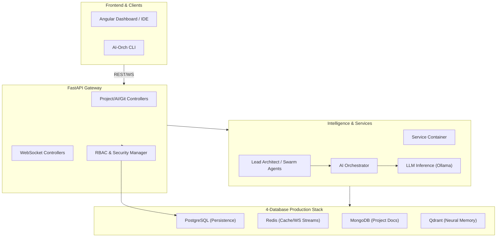

# 🚀 AI Orchestrator: The Ultimate 2026 AI Agent Platform

[](https://www.python.org/)
[](https://fastapi.tiangolo.com/)
[](https://opensource.org/licenses/MIT)
[](https://www.docker.com/)

**AI Orchestrator** is a high-performance, modular Platform-as-a-Service (PaaS) core designed for end-to-end project life cycle management. Powered by local AI (Ollama) and a robust 4-database production stack, it provides unlimited intelligence for building, migrating, and securing large-scale applications.

---

## 🏗️ System Architecture

The project follows a **Modular Controller-based Architecture** with a centralized **Service Container** for dependency injection and state management.



---

## 📖 Swagger: API Documentation & Design Tools

Seamlessly integrate with frontend teams and design workflows using our built-in documentation and design tools.

### 🚀 Interactive API Console
- **Swagger UI:** [http://localhost:8000/docs](http://localhost:8000/docs)  
  *Test and explore every endpoint in real-time with automatic request/response schema validation.*
- **ReDoc:** [http://localhost:8000/redoc](http://localhost:8000/redoc)

---

## 📋 Comprehensive API & WebSocket Specification

<details>
<summary><b>🧠 Core AI & Inference Endpoints</b></summary>

| Endpoint | Method | Description | Request Body |
| :--- | :--- | :--- | :--- |
| `/api/generate` | `POST` | Generate full project or component. | `{"project_name": "...", "languages": {...}}` |
| `/api/migrate` | `POST` | Migrate logic between frameworks. | `{"source_stack": "...", "target_stack": "..."}` |
| `/api/fix` | `POST` | AI-powered bug resolution. | `{"code": "...", "issue": "..."}` |
| `/api/analyze` | `POST` | Security & quality analysis. | `{"code": "...", "analysis_type": "..."}` |
| `/api/test` | `POST` | Unit/Integration test generation. | `{"code": "...", "test_framework": "..."}` |
| `/api/optimize` | `POST` | Performance tuning pass. | `{"code": "...", "optimization_goal": "..."}` |
| `/api/refactor` | `POST` | Architectural logic refactoring. | `{"code": "...", "refactoring_goal": "..."}` |
| `/api/explain` | `POST` | Natural language logic explanation. | `{"code": "...", "language": "..."}` |
| `/inference` | `POST` | Low-level AI model inference. | `{"prompt": "...", "model": "..."}` |
| `/inference/stream`| `POST` | Streaming AI response (SSE). | `{"prompt": "..."}` |
| `/models` | `GET` | List all local/Ollama models. | `N/A` |
</details>

<details>
<summary><b>📂 Project Lifecycle & Runtimes</b></summary>

| Endpoint | Method | Description |
| :--- | :--- | :--- |
| `/api/user/{uid}/projects` | `GET/POST` | Management of user-specific projects. |
| `/api/projects/{pid}/open` | `POST` | Load into IDE Workspace (Clone + Init). |
| `/api/projects/{pid}/sync` | `POST` | Pull latest from Git and update state. |
| `/api/projects/{pid}/build` | `POST` | Trigger AI-monitored build build process. |
| `/api/projects/{pid}/run` | `POST` | Start project in isolated sandbox environment. |
| `/api/projects/{pid}/stop` | `POST` | Terminate running project instance. |
| `/api/projects/{pid}/logs` | `GET` | Retrieve real-time execution logs. |
| `/api/projects/{pid}/workflow` | `POST` | Execute complex CI/CD/AI workflows. |
</details>

<details>
<summary><b>💻 IDE & Editor Services</b></summary>

| Endpoint | Method | Description |
| :--- | :--- | :--- |
| `/api/ide/workspace` | `POST` | Initialize fresh IDE workspace. |
| `/api/ide/files/{sid}/{path}`| `GET/POST/DELETE`| Filesystem operations in IDE context. |
| `/api/ide/tree/{sid}` | `GET` | Full recursive file tree for UI. |
| `/api/ide/completions/` | `POST` | AI-powered code autocompletion. |
| `/api/ide/diagnostics/` | `GET` | Linter and AI diagnostic findings. |
| `/api/ide/debug` | `POST` | Start DAP (Debug Adapter Protocol) session. |
</details>

<details>
<summary><b>🛠️ Git & Infrastructure Tools</b></summary>

| Endpoint | Method | Description |
| :--- | :--- | :--- |
| `/git/config/{provider}`| `POST/DELETE` | Manage tokens (GitHub, GitLab, Bitbucket). |
| `/git/clone` | `POST` | Clone external repository manually. |
| `/git/push/{rid}` | `POST` | Commit and push local changes to remote. |
| `/git/resolve-conflict/` | `POST` | AI-powered merge conflict resolution. |
| `/api/figma/analyze` | `POST` | Design-to-Code: Analyze Figma tokens. |
| `/api/kubernetes/generate` | `POST` | Production K8s manifest orchestration. |
| `/api/security/scan` | `POST` | Full vulnerability report with AI fixes. |
</details>

<details>
<summary><b>⚡ WebSocket Channels (Real-time Flow)</b></summary>

| Channel | Session Path | Purpose |
| :--- | :--- | :--- |
| **Terminal** | `/ws/ide/terminal/{sid}` | Interactive shell access to Docker sandboxes. |
| **Monitoring** | `/ws/monitoring/stream` | Live CPU, Memory, and Build metrics. |
| **Collaboration** | `/ws/collaboration/{sid}` | Multi-user editing and cursor synchronization. |
</details>

---

## 🚀 Deployment

### 1. Launch with Docker (Recommended)
```bash
docker-compose up -d --build
```

### 2. Supported AI Engines
- **Ollama:** Primary high-speed local engine.
- **Models:** `qwen2.5-coder:7b` (Logic), `nomic-embed-text` (Memory).

---

## ⚖️ License
Distributed under the MIT License. Copyright © 2026 Mahmoud Calipso.