# 🚀 AI Orchestrator: The Ultimate AI Agent OS (2026 Edition)

[](https://www.python.org/)
[](https://fastapi.tiangolo.com/)
[](https://www.sqlalchemy.org/)
[](https://www.postgresql.org/)
[](https://redis.io/)
[](https://www.docker.com/)

**AI Orchestrator** is a military-grade, contract-first Platform-as-a-Service (PaaS) core. It provides a unified control plane for autonomous AI swarm coordination, bi-directional repository synchronization, and real-time containerized execution. Designed for the 2026 AI-First enterprise, it features a fully asynchronous architecture and a robust, self-documenting API contract.

---

## 🏛️ High-Fidelity Architecture

The platform is built on a **Modular Service Container** architecture, ensuring total isolation between the intelligence core and infrastructure services.

```mermaid
graph TD
    subgraph Client_Layer["🌐 Premium Ingress"]
        FE["Angular / React / Flutter"]
        CLI["CLI Control Tool"]
        IDP["External IDP (OIDC)"]
    end

    subgraph API_Gateway["⚡ Control Plane (FastAPI)"]
        AUTH["🛡️ Unified RBAC / PQC Sec"]
        PROJ["📂 Async Project Mgr"]
        AI_CNTRL["🧠 Intelligence Controller"]
        GIT["🍴 Managed Git Ops"]
        SYS["📊 Telemetry & Health"]
    end

    subgraph Intelligence_Swarm["🧠 Autonomous Intelligence Core"]
        ORCH["Lead Architect Agent"]
        SWARM["Agent Swarm (Workers)"]
        UNIV["Universal Coding Agent"]
        MEM["🧠 Neural Memory (L1/L2)"]
    end

    subgraph Persistence_Layer["🗄️ Unified Persistence Layer"]
        REGISTRY["Central Model Registry"]
        PG["PostgreSQL (Unified Metadata)"]
        REDIS["Redis (Real-time Bus)"]
        VECTOR["Qdrant (Knowledge Base)"]
    end

    subgraph Runtimes["🏗️ Execution Sanboxes"]
        POD["Docker Sandbox (POD)"]
        WS["WebSocket Streamer"]
    end

    Client_Layer --> API_Gateway
    API_Gateway --> Intelligence_Swarm
    API_Gateway --> Persistence_Layer
    Intelligence_Swarm --> Persistence_Layer
    API_Gateway --> Runtimes
```



---

## 📑 PaaS-Grade Contract-First Specification

The AI Orchestrator follows a **strict contract-first approach**. Every interaction is governed by strongly-typed Pydantic DTOs, ensuring 100% Swagger/Angular compatibility.

### 🚀 Core Intelligence Endpoints
| Component | Endpoint | Contract (DTO) | Purpose |
| :--- | :--- | :--- | :--- |
| **Generation** | `/api/v1/ai/generate` | `GenerationRequest` | Full project/component instantiation via Swarm. |
| **Migration** | `/api/v1/ai/migrate` | `MigrationRequest` | Cross-stack logic healing and tech migration. |
| **Inference** | `/api/v1/ai/inference` | `InferenceRequest` | Direct LLM interaction with runtime management. |
| **Analysis** | `/api/v1/ai/analyze` | `AnalyzeCodeRequest` | Deep semantic code analysis and performance profiling. |

### 📂 Lifecycle & Infrastructure
| Component | Endpoint | Contract (DTO) | Purpose |
| :--- | :--- | :--- | :--- |
| **Projects** | `/api/v1/projects` | `ProjectCreateRequest` | Managed project lifecycle (Build, Run, Sync). |
| **Git Ops** | `/api/v1/git` | `GitCommitRequest` | Bi-directional Repo sync with AI Conflict Resolution. |
| **System** | `/api/v1/system` | `HealthResponseDTO` | Real-time health, uptime, and resource metrics. |

---

## ⚡ Key Features (2026 Edition)

- **🔄 Asynchronous Foundation**: 100% Non-blocking I/O across Database, Git, and AI services for massive scalability.
- **🛡️ unified Security Layer**: Single source of truth for RBAC, API Keys, and JWT management.
- **🧠 Neural Memory**: L1/L2 persistence layer for AI context, ensuring agents remember architectural decisions.
- **🔌 MCP Integration**: Native support for Model Context Protocol (MCP) to bridge internal tools and external AI models.
- **📡 Real-time Observability**: WebSocket-driven log streaming and terminal access for containerized workloads.

---

## 🏎️ Getting Started

### 1. Prerequisites
- **Python 3.11+** (Strictly enforced)
- **PostgreSQL 15+**
- **Ollama** (For local AI intelligence)

### 2. Quick Install
```bash
# Clone and enter
git clone https://github.com/MahmoudCalipso/ai-orchestrator.git
cd ai-orchestrator

# Setup environment
python -m venv .venv
source .venv/bin/activate  # On Windows: .venv\Scripts\activate
pip install -r requirements.txt

# Run migrations and start
make deploy
```

---

## ⚖️ License & Intellectual Property

Distributed under the **Proprietary / Enterprise License**.  
Developed and maintained by **Mahmoud Calipso**.

Copyright © 2026 **Mahmoud Calipso**. All rights reserved.