# 🚀 AI Orchestrator: Enterprise 2026 AI Agent OS

[](https://www.python.org/)
[](https://fastapi.tiangolo.com/)
[](https://kubernetes.io/)
[](https://www.docker.com/)
[](https://ia-orch.example.com/license)

**AI Orchestrator** is a high-performance, modular Platform-as-a-Service (PaaS) core designed for end-to-end project life cycle automation. Orchestrate complex AI agent swarms, automate migrations, and manage production infrastructure with a single unified control plane.

---

## 🏗️ Enterprise Architecture 2026

The platform utilizes a **Distributed Controller Architecture** with a high-performance **Service Container** and a **Hyper-Intelligence Core**.

```mermaid
graph TD
    subgraph Ingress_Layer["🌐 Global Ingress"]
        LB["Load Balancer / Ingress"]
        SSL["Quantum-Safe SSL"]
    end

    subgraph API_Layer["⚡ Control Plane (FastAPI)"]
        AUTH["RBAC & Security"]
        CONT["V1 Controllers"]
        WS["WebSocket Gateway"]
    end

    subgraph Intelligence_Core["🧠 Hyper-Intelligence Ops"]
        ORCH["AI Orchestrator"]
        RED["RedTeam AI (Sec)"]
        QV["Quantum Vault (PQC)"]
        MCP["MCP Bridge (Tools)"]
        KG["Knowledge Graph"]
    end

    subgraph Infrastructure_Layer["☁️ Managed Infrastructure"]
        OLLAMA["Ollama (AI Engine)"]
        PG["PostgreSQL (Data)"]
        REDIS["Redis (Cache/Bus)"]
        MONGO["MongoDB (Docs)"]
        QDRANT["Qdrant (Vector)"]
    end

    Ingress_Layer -->|TLS 1.3| API_Layer
    API_Layer --> Intelligence_Core
    Intelligence_Core --> Infrastructure_Layer
    API_Layer --> Infrastructure_Layer
```



---

## 📖 Production Documentation

### 🚀 Developer Control Plane
- **Interactive Swagger:** [http://localhost:8000/docs](http://localhost:8000/docs)  
- **Enterprise ReDoc:** [http://localhost:8000/redoc](http://localhost:8000/redoc)

### 📊 Health & Observability
| Probe | Path | Purpose |
| :--- | :--- | :--- |
| **Liveness** | `/health/live` | Ensures the container is running and healthy. |
| **Readiness** | `/health/ready` | Ensures sub-systems (DB, Redis) are ready for traffic. |
| **System** | `/api/v1/system/status` | Detailed resource and model telemetry. |

---

## 📋 API & WebSocket Specification (V1 Unified)

<details>
<summary><b>🧠 Advanced AI & Security</b></summary>

| Endpoint | Method | Description |
| :--- | :--- | :--- |
| `/api/v1/ai/generate` | `POST` | Generate full project or component. |
| `/api/v1/ai/migrate` | `POST` | Cross-framework architectural migration. |
| `/api/v1/security/scan` | `POST` | Full RedTeam AI vulnerability assessment. |
| `/api/v1/quantum/vault` | `POST` | Secure PQC-encrypted secret storage. |
</details>

<details>
<summary><b>📂 Core Project Management</b></summary>

| Endpoint | Method | Description |
| :--- | :--- | :--- |
| `/api/v1/projects` | `GET/POST` | Project lifecycle and metadata management. |
| `/api/v1/git/sync` | `POST` | Bi-directional repository synchronization. |
| `/api/v1/ide/workspace` | `POST` | Remote IDE environment initialization. |
</details>

<details>
<summary><b>⚡ Real-time Stream Gateway</b></summary>

| Protocol | Path | Usage |
| :--- | :--- | :--- |
| `WS` | `/ws/ide/terminal/{sid}` | **Cloud Shell**: Low-latency terminal access. |
| `WS` | `/ws/monitoring/stream` | **Observability**: Live telemetry metrics. |
| `WS` | `/ws/collaboration/{sid}` | **Sync**: Real-time multi-agent peer review. |
</details>

---

## 🚀 Deployment Workflows

### 🏎️ Local "On-the-Fly"
The fastest way to get started with the "Doctor" checked environment:
```bash
# 1. Initialize environment & verify dependencies
make setup
make doctor

# 2. Start the Orchestrator
make run
```

### 🐳 Docker Orchestration
Multi-service stack with optimized profile management:
```bash
# Production minimal stack
docker-compose up -d

# Enterprise AI stack (Includes Ollama & Gpu ops)
docker-compose --profile full up -d
```

### ☸️ Kubernetes (Enterprise)
Manifest-based deployment for high-availability clusters:
```bash
# One-command K8s deploy
make k8s-apply

# Verify status
make k8s-status
```

---

## ⚖️ License & Credits
Distributed under the **Proprietary / Enterprise License**.  
Copyright © 2026 **Mahmoud Calipso**. All rights reserved.